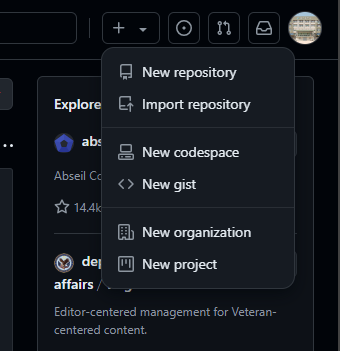
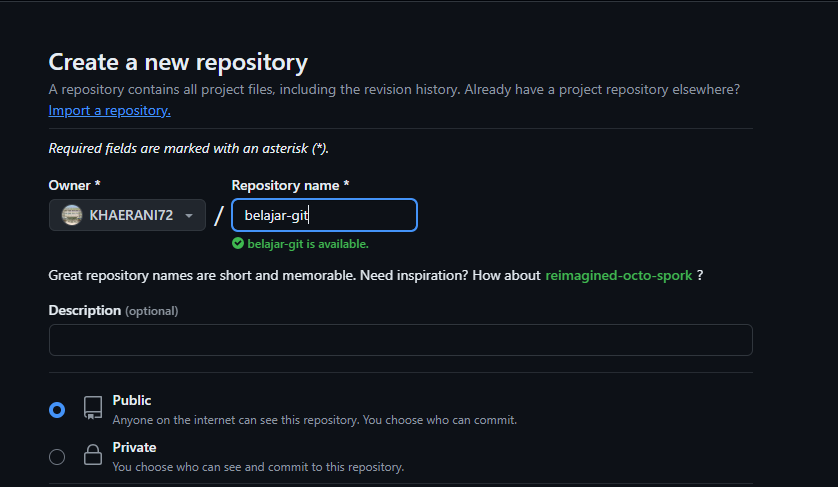
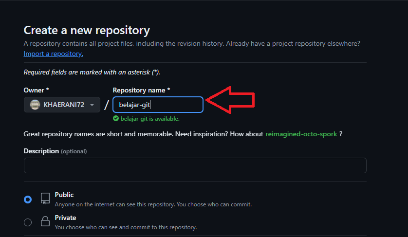
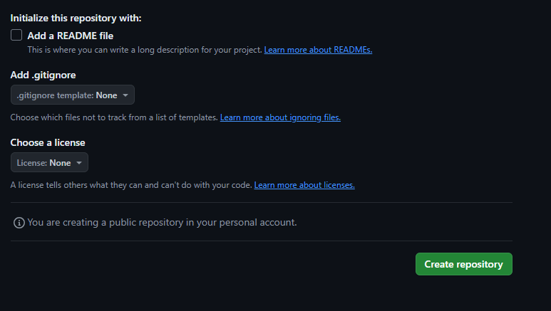

# Instalasi Git Bash
1. download Git-scm pada browser 
   
2. lalu klik Git Hub yang telah di instal 
3. Lalu akan muncul tampilan seperti gambar
  
4. Maka klik 'next' terus hingga mendapatkan tampilan seperti gambar
    

# Login Akun Github
1. Buka aplikasi github di browser https://github.com/
2. Lalu lakukan sign up pada github
   
3. Jika sudah memiliki akun langsung masukkan password dan username yang ada
  
4. Jika tidak memiliki akun klik tambahkan akun
 
5. Setelah buat akun maka akan tampil seperti gambar
  
# Buat Repository
1. jika sudah sign up pada github 
    
2. Lalu klik 'New repository' 
  
3. Tambahkan nama repository yang di inginkan
  
4. Lalu klik 'Create repository' maka repository akan di buat
   
5. Setelah membuat repository maka akan tampil seperti gambar
   

# Konfigurasi Awal di Git Bash 
1.  Menampilkan konfigurasi Git 
  CODE : 
  
  ```bash
  git config --list
  ```

  
2.  tambahkan username dan email pada Git Bash
   code:
 ```bash
    git config --global user.name "username" 
    git config --global user.email "email"
   ```
  
3. cek apabila sudah di masukkan
   code
 ```bash
   git config --list
  ```
  
# Akses Folder Proyek pada Git bash 
1. Buat folder baru pada obsidian
 
   
2. Buat file pada folder yang telah dibuat
  
   
3. Akses folder pada Git Bash
   dengan menggunakan perintah cd (change directory ) sampai ke folder obsidian yang telah di buat 
 
  
   
# Menghubungkan Folder Proyek Lokal ke Github
1.  Menginisialisasi repositori Git
  code : 
 ```bash
  git init
  ```
  
 
 - `git init` : digunakan untuk memulai repositori Git baru di direktori yang ada.
2.  Menambahkan repositori remote sebagai origin pada repositori lokal Git
  code:
  ```bash
  git remote add origin "url_repositori"
 ```
 
  
 analisis 
 - `git remote` : digunakan untuk mengelola repositori remote (server Git) yang terhubung dengan repositori lokal.
 - `add` : digunakan untuk menambahkan repositori remote baru.
 - `origin` : adalah nama konvensional untuk repositori remote utama.
 - `URL` : adalah URL dari repositori remote yang ingin ditambahkan.
3.  Membuat commit baru di repositori Git
  code : 
  ```bash 
  git commit -m "awal_belajar"
  ```
  
   
  analisis : 
  - `git commit` : digunakan untuk menyimpan perubahan dari staging area ke dalam riwayat commit di repositori Git.
  - `-m` : digunakan untuk menyertakan pesan commit langsung di baris perintah. 
  - `awal_belajar` : adalah pesan commit yang mendeskripsikan perubahan yang dibuat.
4.  Menambahkan semua perubahan dalam direktori
  code : 
  ```bash
  git add .
  ```
  
  
  analisis : 
  - ` git add`  :  digunakan untuk menambahkan perubahan file ke staging area sebelum melakukan commit.
  - `.` : Simbol titik menunjukkan bahwa ketika ingin menambahkan semua perubahan dari direktori.
5. Mengirim (push) perubahan dari repositori lokal ke repositori remote
  code: 
  ```bash
  git push origin master
  ```
  
 
 analisis : 
 - `git push ` : digunakan untuk mengirim perubahan yang telah di-commit dari repositori lokal ke repositori remote.
 - `origin` : adalah nama default untuk repositori remote utama yang dikonfigurasi untuk repositori lokal.
 - `master` : adalah nama cabang (branch) yang ingin Anda kirimkan ke repositori remote.
6. setelah itu maka akan tampil seperti pada gambar
 
   
7. lalu klik "Sign in with your browser" masukkan password dan username
 
  
8. setelah masukkan username dan password maka akan tampil seperti pada gambar
  
   
 
9. lalu klik " authorize git-ecosystem" maka akan tampil seperti pada gambar 
  
   

10. setelah itu, buka https://github.com/ lalu ke repositori yang telah dibuat 
  
   
 

